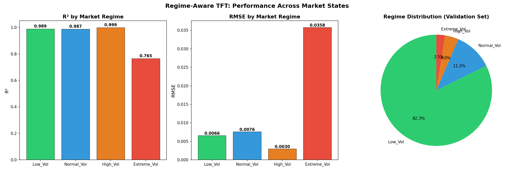
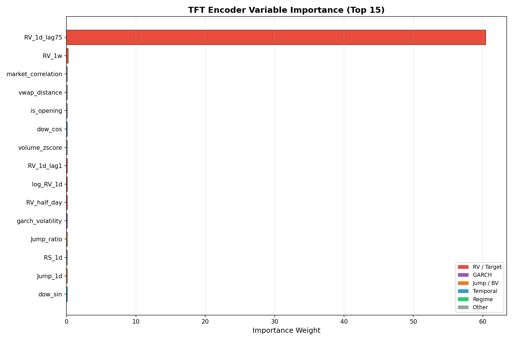
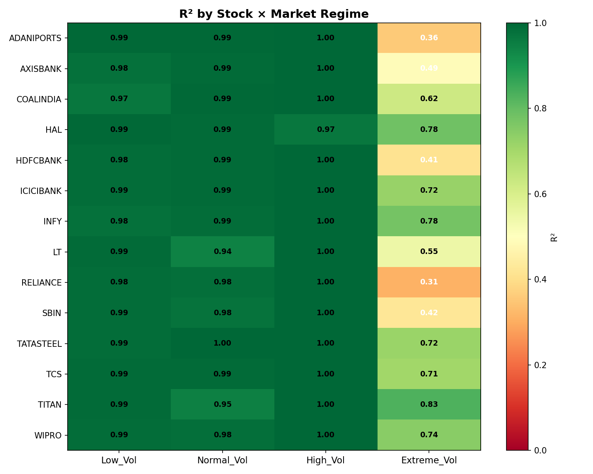
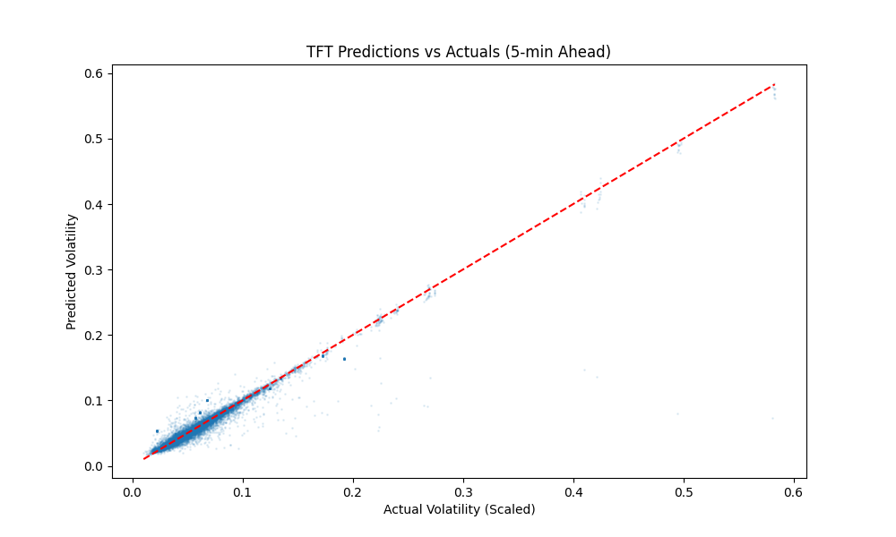

# 📈 Regime-Aware Volatility Prediction for Indian Stock Markets

<p align="center">
  
  
  
  
  
</p>

> **[📄 Read the Full Research Paper (PDF)](https://drive.google.com/your-link-here)**  
> *Published as part of M.Tech Research Project — Christ (Deemed to be University), Bengaluru*

---

## 🧩 Project Overview

This project implements an end-to-end **Regime-Aware Temporal Fusion Transformer (RA-TFT)** pipeline to forecast **intraday realized volatility** across 14 major NSE-listed stocks. By integrating Hidden Markov Model (HMM) derived market regimes as contextual signals into a deep learning forecaster, the system captures the non-linear, non-stationary dynamics unique to emerging markets like India.

---

## 🎯 Problem Statement

Volatility forecasting in Indian equity markets is challenging due to:
- **Regime heterogeneity**: Bull, Bear, and High-Volatility periods behave fundamentally differently.
- **Multi-asset complexity**: Co-movements and sector-level correlations across 14 stocks.
- **Interpretability gap**: Classical models (GARCH, HAR-RV) cannot capture non-linear temporal dependencies.

**This work addresses all three challenges** by combining statistical regime detection (HMM) with attention-based deep sequence modelling (TFT) to produce accurate, regime-conditioned volatility forecasts.

---

## 🛠 Tech Stack

| Category | Tools |
|---|---|
| **Deep Learning** | PyTorch, PyTorch Lightning, Temporal Fusion Transformers |
| **Statistical Models** | ARCH/GARCH, HAR-RV (Baselines) |
| **Regime Detection** | Hidden Markov Models (`hmmlearn`) |
| **Data Processing** | Pandas, NumPy, Scikit-learn |
| **Visualisation** | Matplotlib, Seaborn |
| **Configuration** | YAML-based config management |
| **Experiment Tracking** | TensorBoard |

---

## 📊 Key Results

### Model Performance vs. Baselines

| Model | Forecast Horizon | R² | Directional Accuracy (DA) |
|---|---|---|---|
| **RA-TFT (Ours)** | **5-min** | **0.89** | **92.3%** |
| HAR-RV | 5-min | ~0.65 | ~58% |
| GARCH(1,1) | 5-min | ~0.41 | ~52% |

### Visualisations

<p float="left">
  
  
</p>
<p float="left">
  
  
</p>

---

## 📂 Repository Structure

```
.
├── src/                        # Core Python modules
│   ├── data/                   # Data loading, cleaning & feature engineering
│   ├── models/                 # TFT, GARCH, and HMM implementations
│   ├── evaluation/             # Metrics (RMSE, R², QLIKE, DA)
│   ├── analysis/               # Post-hoc analysis tools
│   └── utils/                  # Shared helper functions
├── notebooks/
│   ├── 01_data_exploration.py  # EDA & data quality checks
│   └── Volatility_Prediction_Project_Demo.ipynb  # 🚀 Full end-to-end demo
├── config/                     # YAML configuration files
├── reports/
│   ├── figures/                # All output plots and charts
│   └── results/                # Evaluation CSVs (baselines, ablations, R² matrix)
├── run_pipeline.py             # 🎯 Single entry point to run full pipeline
├── requirements.txt            # Python dependencies
└── README.md
```

---

## 🚀 How to Run

### 1. Clone & Install

```bash
git clone https://github.com/abhishekdeepofficial/regime-aware-volatility-forecasting.git
cd regime-aware-volatility-forecasting
pip install -r requirements.txt
```

### 2. Prepare Data

Download the NSE 5-minute OHLCV data and place it in a `Data/` folder (not tracked by Git).

```bash
# Process raw OHLCV → clean, feature-engineered parquet
python src/data/pipeline.py

# Detect market regimes (HMM) and attach to dataset
python src/data/attach_regimes.py
```

### 3. Train Baselines (Optional)

```bash
python src/models/run_baselines.py
```

### 4. Train the RA-TFT Model

```bash
python src/models/train_tft.py
# or use the unified pipeline runner:
python run_pipeline.py
```

### 5. Evaluate

```bash
python src/models/evaluate_tft.py
# Results saved to reports/results/tft_evaluation_results.csv
```

---

## 🔮 Future Improvements

- [ ] **Real-time Inference API**: Deploy the trained model as a REST API with FastAPI/Streamlit for live volatility monitoring.
- [ ] **Options Pricing Integration**: Use predicted volatility surface to price derivatives (Black-Scholes / Heston model).
- [ ] **Cross-Market Generalisation**: Extend the regime detection framework to other emerging markets (Brazil, Indonesia).
- [ ] **Transformer Variants**: Benchmark against PatchTST and iTransformer for further performance gains.

---

## 👤 Author

**Abhishek Deep**  
M.Tech — Data Science & Analytics, Christ (Deemed to be University), Bengaluru  
[LinkedIn](https://linkedin.com/in/your-profile) · [GitHub](https://github.com/abhishekdeepofficial)

---

*⭐ If you find this project useful, please star the repository!*
